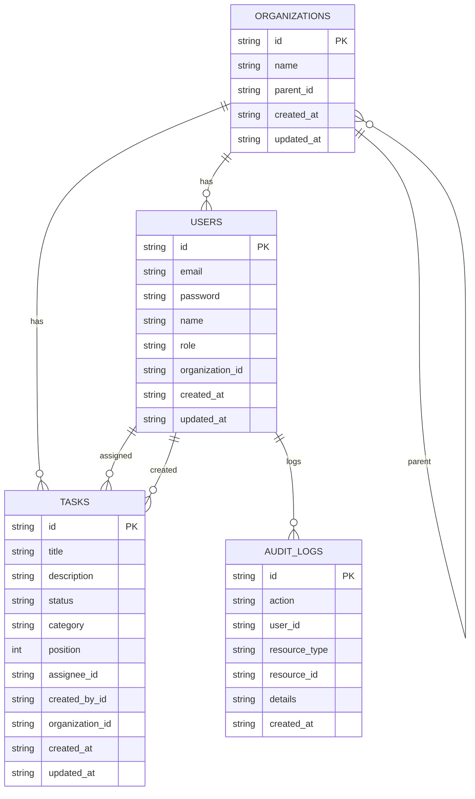

# Secure Task Management System

A secure task management system with role-based access control (RBAC) built in an Nx monorepo.

**Stack**
- Backend: NestJS + SQLite Cloud (`sqlitecloud.io`) via `@sqlitecloud/drivers`
- Frontend: Angular + TailwindCSS
- Shared libs: `libs/data`, `libs/auth`

## Repository Structure

```
apps/
  api/                NestJS backend (http://localhost:3000/api)
  dashboard/          Angular frontend (http://localhost:4200)
libs/
  data/               Shared DTOs + types
  auth/               RBAC logic (roles, permissions)
```

## Setup

1. Install dependencies

```bash
npm install
```

2. Configure environment

```bash
cp apps/api/.env.example apps/api/.env
```

Set these values in `apps/api/.env`:

```
JWT_SECRET=your-secret-key
SQLITECLOUD_URL=sqlitecloud://<host>:<port>/<db>?apikey=<key>
```

3. Run backend

```bash
npx nx serve api
```

4. Run frontend

```bash
npx nx serve dashboard
```

## Architecture Overview

- **NX monorepo** provides shared libraries and isolated apps.
- **`libs/data`**: shared DTOs/types used by both backend and frontend.
- **`libs/auth`**: RBAC helpers (role hierarchy, permissions, org access logic).
- **Backend** uses SQLite Cloud with a lightweight repository layer and SQL schema bootstrap.
- **Frontend** uses Angular standalone components + signals for local state.

## Data Model (ERD)



## Access Control Implementation

Roles follow inheritance: `Owner > Admin > Viewer`.

Permissions:
- **Owner**: create/read/update/delete tasks, view audit logs, manage users
- **Admin**: create/read/update/delete tasks, view audit logs
- **Viewer**: read tasks only

Organization scoping:
- **Viewer/Admin**: only their own organization.
- **Owner**: their own organization + child orgs.

This is enforced by:
- `@Permissions()` decorator + `PermissionsGuard`
- org scoping in `TasksService` using accessible org ids

## API Documentation

Base URL: `http://localhost:3000/api`

### Auth
- `POST /auth/login`

```json
{ "email": "owner@acme.com", "password": "password123" }
```

- `POST /auth/register`

```json
{ "email": "user@example.com", "password": "Test@1234", "name": "User", "organizationId": "<org-id>" }
```

### Tasks
- `GET /tasks`
- `POST /tasks`

```json
{ "title": "New task", "description": "details", "status": "todo", "category": "work" }
```

- `PUT /tasks/:id`

```json
{ "status": "in_progress" }
```

- `DELETE /tasks/:id`

### Audit Logs
- `GET /audit-log`

## Frontend

- Login page with JWT storage.
- Register page with org id input.
- Task dashboard with filters + drag-and-drop status changes.
- Audit log view for Admin/Owner.
- Light/Dark mode toggle.

## Testing

Tests are not fully wired due to Nx daemon/plugin issues in this environment. Unit tests should cover:
- Auth and RBAC logic (backend)
- Task CRUD and org scoping (backend)
- Login and tasks UI/services (frontend)

## Tradeoffs / Known Issues

- Nx daemon/plugin errors may block running tests in this environment; run with `NX_DAEMON=false` if needed.
- Viewer visibility is strictly scoped to their organization. If Owners create tasks in parent orgs, child-org viewers won't see them unless tasks are assigned into their org.
- Registration UI requires manual `organizationId` entry.

## Future Considerations

- JWT refresh tokens
- CSRF protection
- RBAC caching
- Pagination for tasks/audit logs
- Role delegation + organization admin workflows
- Production-grade auditing and retention policies
# Kamlesh-Prajapati-KPrajapati-0a19fc14-d0eb-42ed-850d-63023568a3e3
# Kamlesh-Prajapati-KPrajapati-0a19fc14-d0eb-42ed-850d-63023568a3e3
